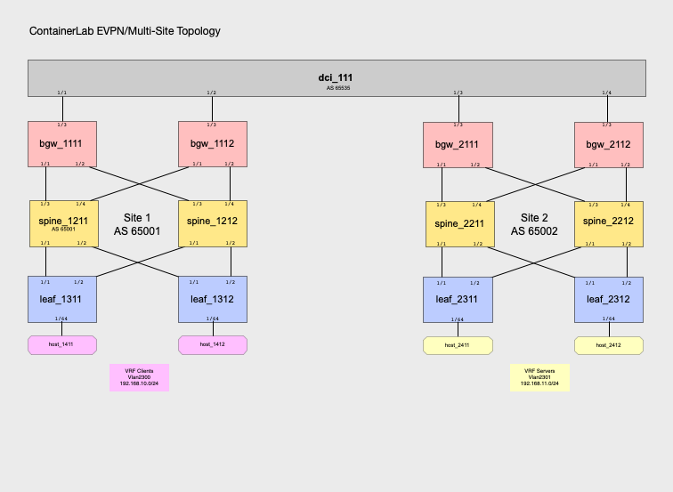
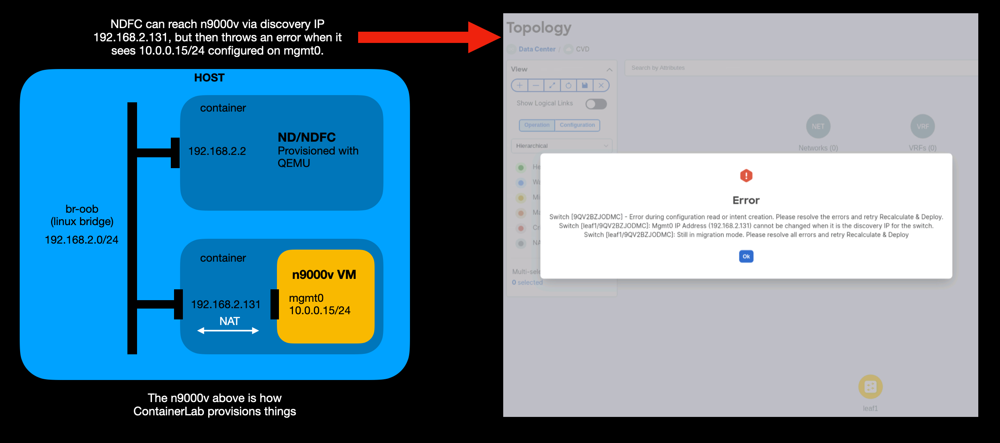

# ContainerLab

See [00_ContainerLab_Main](/docs/containerlab/0_ContainerLab_Main.md) for steps to build a virtual lab using n9000v and ContainerLab.



## 1. [Downloading Containerlab](/docs/containerlab/1_ContainerLab_Download.md)

See [ContainerLab](https://containerlab.dev) to download ContainerLab and for instructions for installation.

[ContainerLab Installation Instructions](https://containerlab.dev/install/)

```bash
# download and install the latest release (may require sudo)
bash -c "$(curl -sL https://get.containerlab.dev)"
```

## Contents

### Topology file for ContainerLab

topo.yml launches the n9000v containerized VMs and provisions the inter-switch links and endpoints.

You will want to edit the HTTPS_PROXY and NO_PROXY environment vars for the linux hosts in this file.  You may also want to use the wbitt/network-multitool:alpine-extra container instead of mine (quantumonion/nettool:latest).

The only difference between these is I changed the default NGINX web page to display the VRF in which the host resides.

```yaml
topology:
  kinds:
    vr-n9kv:
      image: quantumonion/n9kv:10.3.1
    linux:
      #image: wbitt/network-multitool:alpine-extra
      image: quantumonion/netool:latest
      env:
        HTTPS_PROXY: http://proxy.esl.cisco.com:80
        NO_PROXY: cisco.com,arobel.com,localhost,172.31.165.33
```

### Add linux bridges for the n9000v management network.

The below adds this only temporarily, so you'll have to add it again after each reboot.  There's plenty of documentation out there for adding these permanently.

```bash
sudo brctl addbr br-oob
sudo ifconfig br-oob up
sudo ip address add 192.168.2.1/24 dev br-oob
```

### If you're using NDFC under KVM, NDFC expects a data network, in addition to the above management network.

```bash
sudo brctl addbr br-vnd
sudo ifconfig br-vnd up
sudo ip address add 192.168.3.1/24 dev br-vnd
```

#### To deploy the lab
```bash
containerlab deploy --topo topo.yml
```

#### To inspect the running lab
```bash
containerlab inspect --topo topo.yml
```

#### To destroy the lab
```bash
containerlab destroy --topo topo.yml
```

### Host VM configuration

Hosts connect to the leafs on trunk port Ethernet1/64 in vlan 2300 (vrf Clients) and vlan 2301 (vrf Servers).

Use host-config.sh in this directory to add the appropriate vlan configuration for these host VMs.

### Base switch configurations

Since n9000v runs as a containerized VM, there was one challenge in getting this to work with NDFC, as shown in the image below. 



NDFC expects that the mgmt0 address is the switch discovery address.  However, by default, the IP address assigned by ContainerLab to mgmt0 is 10.0.0.15/24. ContainerLab provisions the ``mgmt-ipv4`` and ``mgmt-ipv6`` addresses using Docker.  NAT is used to access each containerized n9000v, where the "outside" address is the ``mgmt-ipv4`` address (e.g. 192.168.2.131 for leaf_11) and the "inside" address is 10.0.0.15/24.  When NDFC "discovers" an n9000v, it sees the 10.0.0.15/24 address and declares it unreachable (since it has only a route to 192.168.2.0/24).  To work around this, the base configs for n9000v in this directory change the mgmt0 addresses such that 10.0.0.15/24 is made a secondary ip address and 192.168.2.x/24 is made the primary address.  In addition, static routes are added for: default (via 10.0.0.2, which is the "inside" gateway) and for the NDFC controller (192.168.2.2) and Docker Gateway (192.168.2.1), both also via 10.0.0.2.  For leaf_1311, this looks like:

```bash
vrf context management
  ip route 0.0.0.0/0 10.0.0.2
  ip route 192.168.2.1/32 10.0.0.2
  ip route 192.168.2.2/32 10.0.0.2
interface mgmt0
  ip address 192.168.2.131/24
  no ip redirects
  ip address 10.0.0.15/24 secondary
  no shutdown
```

This **mostly** solves NDFC's reachability issue, but there is still one case where this can be an issue.  When manually discovering containerized n9000v using the NDFC GUI, if you set the seed IP to be, say, the address of leaf_1311 (192.168.2.131), and set max-hops to 2 or 3, NDFC uses CDP to discover the n9000v switches within this 2 or 3 hop radius (using ``show cdp neighbor detail``).  ``show cdp neighbor detail`` returns BOTH the primary and secondary mgmt0 addresses (without differentiating between them), shown below:

```bash
leaf_1311# show cdp neighbor detail  | json-pretty | begin v4mgmtaddr | head lines 4
                "v4mgmtaddr": [
                    "192.168.2.151",
                    "10.0.0.15"
                ],
leaf_1311# 
```

NDFC chooses one of these addresses and, if it chooses by chance the 10.0.0.15 address, then it will declare the n9000v to be unreachable.

### test_web.bash

This script connects to each host container and runs curl to access the web page for all other hosts, thus testing connectivity across sites and within/between VRFs.

Example output for the working case.  We've modified the default NGINX webpage for each host to include the hostname (e.g. host_1411) and VRF (e.g. Clients).

```bash
root@cvd-3:/home/arobel/repos/clab-deploy/MSD/cvd-3# ./test_web.bash 
CVD_3_MSD clab-nxos-host_1411
WBITT Network MultiTool (with NGINX) - host_1411 - Clients - 192.168.2.201 - HTTP: 80 , HTTPS: 443 . (Formerly praqma/network-multitool)
WBITT Network MultiTool (with NGINX) - host_1412 - Servers - 192.168.2.202 - HTTP: 80 , HTTPS: 443 . (Formerly praqma/network-multitool)
WBITT Network MultiTool (with NGINX) - host_2411 - Clients - 192.168.2.203 - HTTP: 80 , HTTPS: 443 . (Formerly praqma/network-multitool)
WBITT Network MultiTool (with NGINX) - host_2412 - Servers - 192.168.2.204 - HTTP: 80 , HTTPS: 443 . (Formerly praqma/network-multitool)
CVD_3_MSD clab-nxos-host_1412
WBITT Network MultiTool (with NGINX) - host_1411 - Clients - 192.168.2.201 - HTTP: 80 , HTTPS: 443 . (Formerly praqma/network-multitool)
WBITT Network MultiTool (with NGINX) - host_1412 - Servers - 192.168.2.202 - HTTP: 80 , HTTPS: 443 . (Formerly praqma/network-multitool)
WBITT Network MultiTool (with NGINX) - host_2411 - Clients - 192.168.2.203 - HTTP: 80 , HTTPS: 443 . (Formerly praqma/network-multitool)
WBITT Network MultiTool (with NGINX) - host_2412 - Servers - 192.168.2.204 - HTTP: 80 , HTTPS: 443 . (Formerly praqma/network-multitool)
CVD_3_MSD clab-nxos-host_2411
WBITT Network MultiTool (with NGINX) - host_1411 - Clients - 192.168.2.201 - HTTP: 80 , HTTPS: 443 . (Formerly praqma/network-multitool)
WBITT Network MultiTool (with NGINX) - host_1412 - Servers - 192.168.2.202 - HTTP: 80 , HTTPS: 443 . (Formerly praqma/network-multitool)
WBITT Network MultiTool (with NGINX) - host_2411 - Clients - 192.168.2.203 - HTTP: 80 , HTTPS: 443 . (Formerly praqma/network-multitool)
WBITT Network MultiTool (with NGINX) - host_2412 - Servers - 192.168.2.204 - HTTP: 80 , HTTPS: 443 . (Formerly praqma/network-multitool)
CVD_3_MSD clab-nxos-host_2412
WBITT Network MultiTool (with NGINX) - host_1411 - Clients - 192.168.2.201 - HTTP: 80 , HTTPS: 443 . (Formerly praqma/network-multitool)
WBITT Network MultiTool (with NGINX) - host_1412 - Servers - 192.168.2.202 - HTTP: 80 , HTTPS: 443 . (Formerly praqma/network-multitool)
WBITT Network MultiTool (with NGINX) - host_2411 - Clients - 192.168.2.203 - HTTP: 80 , HTTPS: 443 . (Formerly praqma/network-multitool)
WBITT Network MultiTool (with NGINX) - host_2412 - Servers - 192.168.2.204 - HTTP: 80 , HTTPS: 443 . (Formerly praqma/network-multitool)
root@cvd-3:/home/arobel/repos/clab-deploy/MSD/cvd-3# 
```

### vND and NDFC provisioning

If you want to run ND+NDFC on the same host, below is a cheat sheet.

1. You'll need qemu-utils for the qemu-img utility

```bash
sudo apt install qemu-utils
```

2. Create the node1-disk1 image from an ND qcow image

```bash
qemu-img create -f qcow2 -F qcow2 -b /home/arobel/iso/nd/nd-dk9.2.3.2d.qcow2 ./nd-node1-disk1.qcow2
```

3. Create the node1-disk2 image

```bash
qemu-img create -f qcow2 nd-node1-disk2.qcow2 500G
```

4. You'll need [virt-manager](https://ubuntu.com/server/docs/virtualization-virt-tools) for the next steps.

```bash
sudo apt install virt-manager
```

Change the two ``--disk`` arguments to point to the images you created above.  Minimum recommended RAM for ND+NDFC is 64000.  We've increased this to 96000 below based on our experience with this multi-site topology. 

```bash
virt-install --name nd \
    --vcpus 16 --ram 96000 --osinfo linux2020 \
    --disk path=/home/arobel/nd/nd-node1-disk1.qcow2 \
    --disk path=/home/arobel/nd/nd-node1-disk2.qcow2 \
    --network bridge:br-oob,model=virtio,address.type=pci,address.domain=0,address.bus=0,address.slot=3 \
    --network bridge:br-vnd,model=virtio,address.type=pci,address.domain=0,address.bus=0,address.slot=4 \
    --noautoconsole --import
```

NOTE if Virtual Machine Manager gives a permissions error on starting up the ND VM, try the following; substituting your username for ``arobel`` below.

```bash
sudo usermod -G kvm "arobel"
sudo usermod -G libvirtd "arobel"
ls -ld /dev/kvm
crw-rw---- 1 root kvm 10, 232 Jun 20 23:52 /dev/kvm  << These are correct permissions
```
